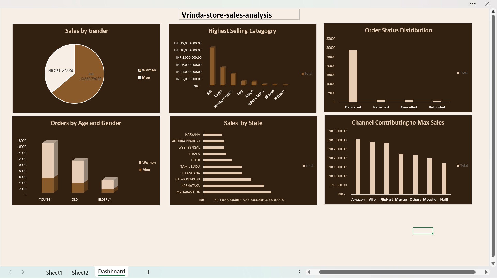

# Vrinda Store Analysis

Analysis of e-commerce order data for an online clothing store, focused on **sales performance across Indian states and sales channels** (Amazon, Ajio, Flipkart, Myntra, and others).

## Goal
Understand where and through which channels the store generates the most revenue, and how sales break down by category, order status, and customer demographics.

## Tools
Excel (PivotTables, PivotCharts)

## Dataset
`Vrinda_Store_Analysis_report_.xlsx` — 31,050 order records with fields:
`Order ID, Cust ID, Gender, Age, Date, Status, Channel, SKU, Category, Size, Qty, Amount, ship-city, ship-state, ship-postal-code, ship-country, B2B, Age Group`

The workbook contains:
- **Sheet1** — raw order-level data
- **Sheet2** — pivot summaries (sales by state, order status, channel)
- **Dashboard** — a 6-panel visual summary

## Key observations
- **Maharashtra, Karnataka, and Uttar Pradesh** are the top-selling states by revenue.
- **Sets, kurtas, and Western dresses** are the best-selling categories.
- The vast majority of orders are marked **Delivered**, with a small share returned, cancelled, or refunded.
- **Amazon, Ajio, and Flipkart** are the leading sales channels by revenue.
- Sales skew slightly higher among **male-attributed orders**, and the **young** age group accounts for the most orders.

## Preview 

## How to use
1. Download `Vrinda_Store_Analysis_report_.xlsx`
2. Open in Excel
3. Explore the `Dashboard` sheet for the visual summary, or `Sheet1` / `Sheet2` for raw data and pivot calculations

## Data source
Public e-commerce order dataset (commonly used for retail analytics practice — order-level sales, shipping, and channel data).
